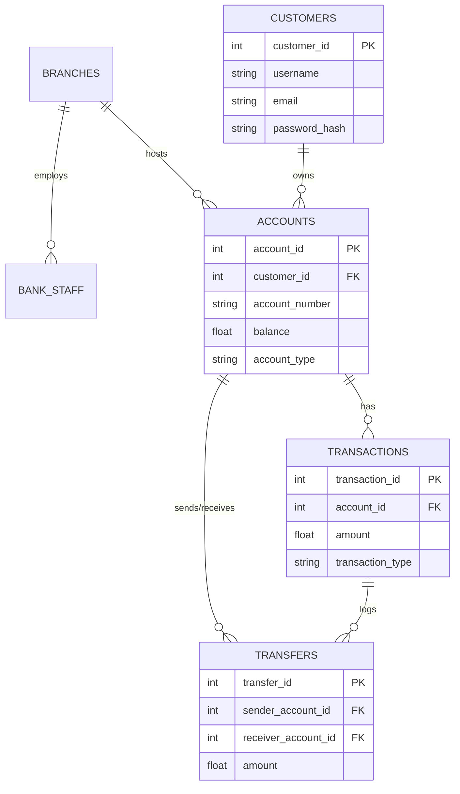

# Vaultix Enterprise Banking System - Project Report
Course: CSC 302 - Object-Oriented Programming

## 1. Project Overview
Vaultix is a robust, full-stack enterprise banking application. It demonstrates strict adherence to Object-Oriented Programming (OOP) principles and integrates with a fully normalized Oracle relational database to ensure ACID compliance and transaction safety.

---

## 2. Object-Oriented Programming (OOP) Concepts Demonstrated

1. **Classes and Objects**: Used extensively to model the banking domain (e.g., `Customer`, `Account`, `SavingsAccount`).
2. **Encapsulation**: Private and protected properties are heavily utilized in the data models (e.g., `__balance` in `base_account.py`), accessed only via getters/setters and property decorators to ensure state integrity.
3. **Inheritance**: Implemented in account hierarchies, where `SavingsAccount` and `CurrentAccount` inherit common functionality from the abstract `Account` base class.
4. **Polymorphism**: The `withdraw()` method behaves differently depending on the class calling it (e.g., `SavingsAccount` prevents overdrawing, whereas `CurrentAccount` permits drawing up to an overdraft limit).
5. **Abstraction**: Handled via the Python `ABC` module. `Account` is an abstract base class (`ABC`), and `withdraw()` is defined as an `@abstractmethod`.
6. **Constructors**: The `__init__` methods are thoroughly used to instantiate initial states.
7. **Method Overriding**: Child classes (`SavingsAccount`, `CurrentAccount`) explicitly override the `withdraw()` method.
8. **Exception Handling**: Custom exceptions (`InsufficientFundsException`) and built-in handlers are used across the backend to gracefully manage runtime errors.
9. **Database Integration**: Fully integrated with an Oracle backend using PL/SQL, or a mocked JSON simulator for portability.

---

## 3. Database Design & Architecture

### Entity-Relationship (ER) Diagram



### Database Normalization Explanation

The Oracle database has been normalized to the 3rd Normal Form (3NF) to eliminate data redundancy and ensure data integrity:

- **1st Normal Form (1NF)**: All attributes contain atomic values. For example, `first_name` and `last_name` are separated rather than being stored in a single `full_name` column. All tables possess primary keys (e.g., `account_id`, `transaction_id`).
- **2nd Normal Form (2NF)**: The database achieves 1NF, and all non-key attributes are fully functionally dependent on the primary key. For example, in the `Accounts` table, the `balance` relies entirely on `account_id`, not on a composite key or a subset.
- **3rd Normal Form (3NF)**: The database achieves 2NF, and there are no transitive dependencies. For instance, the `Transfers` table does not redundantly store customer names; it links to `Accounts` (`sender_account_id`), which links to `Customers` (`customer_id`). Any customer detail modification happens exclusively in the `Customers` table.

### Query Optimization Examples
To ensure that queries execute rapidly and improve overall banking performance even with millions of transactions, the database uses several optimization techniques:

1. **Transaction Lookup Optimization (Indexes)**:
   ```sql
   CREATE INDEX idx_tx_account ON Transactions(account_id);
   CREATE INDEX idx_tx_date ON Transactions(created_at);
   ```
   *Explanation*: Banking apps frequently query "get all transactions for this account ordered by date". Indexing `account_id` and `created_at` prevents slow, full table scans, drastically reducing load times for the Transaction History page.

2. **Login/Authentication Optimization (Indexes)**:
   ```sql
   CREATE INDEX idx_cust_username ON Customers(username);
   ```
   *Explanation*: Indexing the `username` ensures quick Hash or B-Tree lookups during the login flow, allowing the system to scale to thousands of concurrent logins without bottlenecking.

3. **Optimized Joins**:
   *Explanation*: The schema enforces strict Foreign Key constraints (e.g., `Accounts` to `Customers`). Because Foreign Keys are inherently indexed and constrained, performing SQL `JOIN` operations (e.g., fetching a user's profile alongside their account balances) executes in logarithmic time rather than exponential time.

4. **Constraints for Performance**:
   *Explanation*: Utilizing `CHECK (balance >= 0)` and `NOT NULL` constraints prevents the database engine from having to process and rollback invalid data deep in the application logic, shifting validation to the fastest layer (the database engine itself).

---

## 4. Live Demonstration Instructions

Follow these steps to demonstrate the application to your professor:

### Step 1: Environment Setup
1. Open a terminal and activate your Python virtual environment.
2. Install dependencies: `pip install -r requirements.txt`.
3. Set the environment variable `USE_ORACLE=false` to use the portable local JSON mock database, or `USE_ORACLE=true` to connect to your live Oracle database.

### Step 2: Running the Application
1. Start the Flask application by running: `python run.py`.
2. Open your web browser and navigate to `http://127.0.0.1:5000/`.

### Step 3: Core Demonstration Flow
1. **Registration & Encapsulation Demo**: 
   - Register a new customer.
   - Show how the backend validates and encapsulates the password (hashing it) before inserting it.
2. **Account Abstraction & Inheritance**:
   - Point out that two accounts (Savings and Current) are automatically created.
   - Show the professor `models/base_account.py` and `models/accounts.py` to highlight Inheritance and Polymorphism.
3. **Transaction ACID Demo (Transfers)**:
   - Initiate a transfer from Savings to Current. 
   - Explain the `PROCESS_TRANSFER` PL/SQL stored procedure (or its backend equivalent), emphasizing that if the server crashes mid-transfer, a `ROLLBACK` is triggered ensuring money isn't lost.
4. **Exception Handling**:
   - Attempt to withdraw or transfer more money than is in the account.
   - Show how the UI gracefully handles the `InsufficientFundsException` thrown by the polymorphic `withdraw()` method.
5. **Database Triggers & Auditing**:
   - Show the `AuditLogs` table in your Oracle client. Explain how the `trg_audit_transactions` trigger works invisibly in the background.
