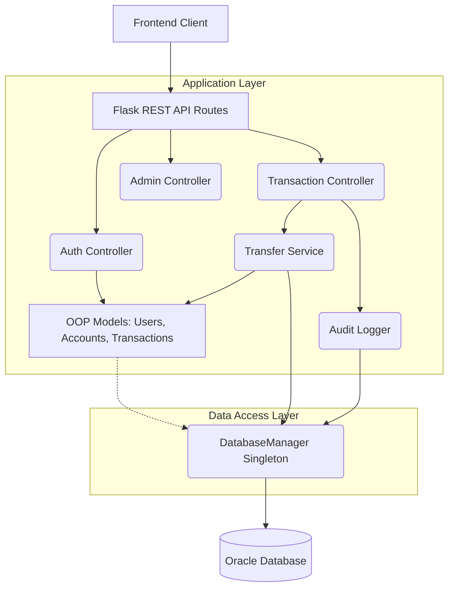
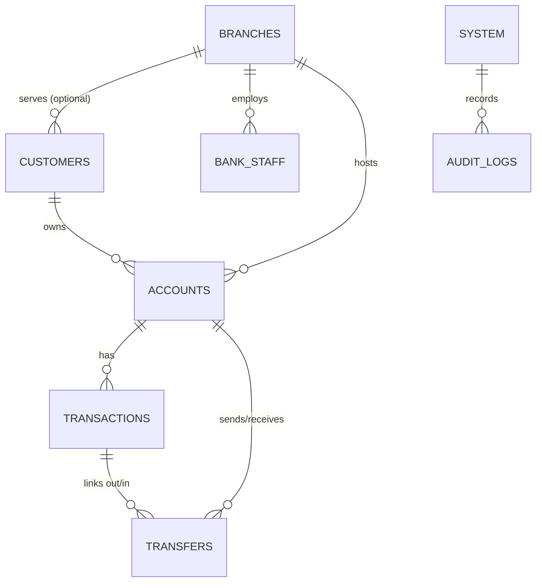

# Vaultix Enterprise Banking Architecture

## System Architecture

Vaultix Bank follows an MVC-inspired, 3-tier enterprise architecture.
- **Presentation Layer**: HTML/Vanilla CSS/JS front-end.
- **Application Layer**: Python Flask backend with encapsulated Object-Oriented Services.
- **Data Access Layer**: Singleton `DatabaseManager` executing raw SQL/PLSQL directly against an Oracle Database.

## Entity Relationship Diagram (ERD)

## Normalization & Database Decisions
- **1NF**: All columns hold atomic values. No repeating groups.
- **2NF**: All non-key attributes are fully functional dependent on the primary key (e.g. `ACCOUNT_NUMBER` belongs strictly to `ACCOUNTS`, separate from `CUSTOMERS`).
- **3NF**: No transitive dependencies. E.g., `BRANCH_NAME` relies on `BRANCH_ID`, so it is split into a `Branches` table rather than duplicated in `Staff` or `Accounts`.

## Security & PL/SQL Features
- **ACID Compliant Transfers**: Transfers lock the affected rows using `SELECT FOR UPDATE` to prevent race conditions (deadlock prevention by sorting locks).
- **Triggers**: `trg_audit_transactions` and `trg_audit_accounts` automatically log to the `AuditLogs` table without requiring Python application logic to trigger them.
